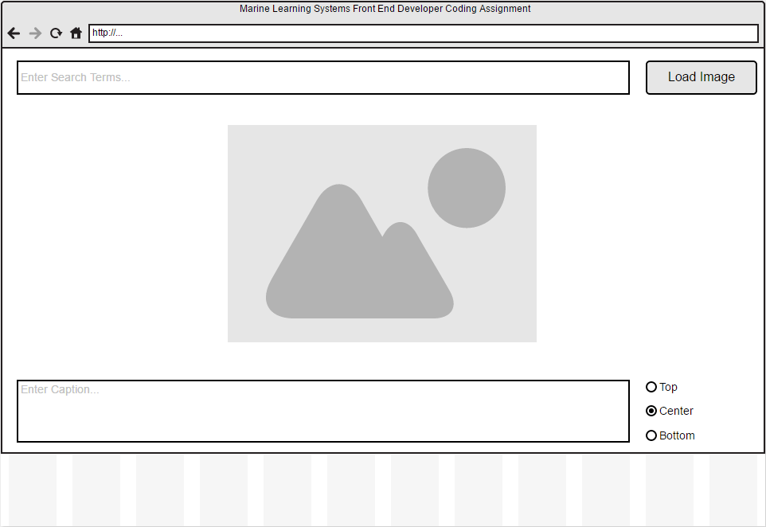

# Marine Learning Systems Front End Developer Coding Assignment

This assignment will see you creating an online _meme_ creation tool, using the [Giphy Search API](https://github.com/Giphy/GiphyAPI#search-endpoint) as an image source. You will allow the user of the web tool to enter some search query terms, click a **Load Image** button, enter a caption and select the caption location. Clicking the load button should present the user with a random image from the Giphy API results (or notify the user somehow that no results were found). This tool simply shows the user what the _meme_ would look like. You do not have to implement saving the image or anything related to image manipulation other than displaying it in the web tool.  Your image should be centered horizontally, be sized appropriately, and retain its aspect ratio. Your caption position choice should place the caption text inside the image at the specified location. All caption text should be centered horizontally. Your web tool should be responsive and handle mobile screen resolutions without impacting the user experience.

## Getting Started

0. fork and clone this repository

## Guidelines

* Your solution should not require anything beyond `npm` to setup and run (i.e. no software beyond what can be acquired using `npm`)
* Running `npm install && npm start` should be the only command required after cloning to demo your app
* You can implement your solution in any way you see fit (given the above two guidelines)
* Make some appropriate creative choices about how to implement and style the web tool
* Loading the Giphy API results should be asynchronous and display a _loading or searching_ visual
* Editing the caption text should appear on the image as it is typed

## Expected Results

Below is a rough mockup for a potential design. You are more than welcome to adjust your web tool appearance as you see fit, the mockup is just a guideline to get your started.

## FAQ

* **Can I use _insert language here_?**
    * Probably, yes, providing the guidelines above are followed.
* **Can I use _insert library here_?**
    * If it can be installed via `npm` you can use it!
* **Do I need to unit/functional test or lint my code?**
    * It is not required, but linting and tests are always great! Primary focus should be the web tool.
* **Do I need to add continuous integration?**
    * You are welcome to set up travis, circleci, appveyor, etc... if you want to, but it is not required
* **Do I need to fully document my code?**
    * Document the code as if you were submitting it for a code review
* **Can I go beyond the guidelines and implement more?**
    * Of course! just make sure you have the basic pieces completed, but we're happy to see how you can get creative with this!
